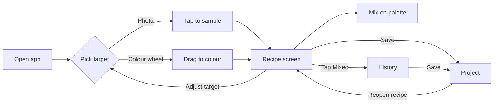

# Oil Paint Mixer — Design Document

## Purpose and use case

The app tells a novice oil-paint mixer how to hit a target colour with the paints on the palette, in as few taps as possible.

**The moment it serves.** I am standing over my palette mid-painting. I can't get a colour right. I pick up the phone, show it the colour I want, and get a parts-based recipe I can mix straight away. Then the phone goes down and I keep painting.

**Design principles**

- **Don't break flow.** Target to recipe in three taps or fewer. No accounts, no onboarding, no loading screens.
- **Colour accuracy over app aesthetics.** The whole interface is neutral mid-grey, with no coloured buttons, accents or backgrounds near swatches, so surrounding colour never distorts how a swatch reads.
- **Studio-proof controls.** Large touch targets, usable one-handed with paint on my fingers.
- **Narrow on purpose.** One job: target colour in, mixing recipe out. Anything else goes in Out of scope.
- **Honest about accuracy.** Screens, photos and wet paint all distort colour. The app says how close a recipe is rather than implying precision.
- **Teaches while it helps.** Recipes show order of addition and value, so mixing ability improves over time instead of depending on the app.

**Two audiences for this document.** I read it back to remember what was decided and why. Claude reads it as the build spec, so every requirement should be explicit rather than implied.

## Colour DNA: the Tischler anchor

Andrew Tischler's 12-colour Studio Guide palette is the starting point for the app's taste in pigments, not a rulebook. The app follows my inventory first; his palette shapes the defaults and the "paints to buy" suggestions.

**The reference palette** (from his Studio Guide)

| Pigment | Role in his system | Character |
| --- | --- | --- |
| Cadmium Lemon | Y (yellow) | Punchy, opaque, bright yellow |
| Quinacridone Magenta | M (magenta) | High-chroma, strong tinter |
| Cobalt Teal | C (cyan) | Nearest oil paint to pure cyan, opaque |
| Ultramarine Blue | Dark blue, part of the black mix | Deep, cool, for shadows |
| Burnt Umber | Knocks chroma down; dark with Ultramarine | Opaque rich brown |
| Burnt Sienna | Warm earth | Reddish, skin tones and underpainting |
| Yellow Ochre | Gentle earth | Skin tones, natural greens |
| Cadmium Red Light | Warm red | Bold, vivid |
| Permanent Crimson | Cool red | Deep red |
| Phthalo Green | Intense green | Very strong tinter |
| Titanium White | Opaque white | Strong, can overpower mixes |
| Cremnitz (Lead) White | Soft white | Subtler, more luminous transitions |

He builds the palette on printer CMYK: Cadmium Lemon, Quinacridone Magenta and Cobalt Teal as Y, M and C. Ultramarine plus Burnt Umber as his dark is documented; that it is his "K" is likely but unconfirmed.

**Principles the app inherits**

- **Single-pigment paints.** Recipes reference pigment names, not "hue" blends or brands. Brand variation is an accepted loss of accuracy.
- **Mute with earths or complements first.** To lower chroma, prefer Burnt Umber or a complement over black.
- **Chromatic darks first, black allowed.** Ultramarine plus Burnt Umber is the default dark. If a black is in my inventory and chromatic darks can't reach the target value, the app may use it. This matters for dark, low-key paintings.
- **Value before hue.** Getting lightness right matters more than exact hue, so every result shows value.

**Where the app departs from him.** It is not a Tischler app. Any pigment in my inventory is fair game, including black and paints outside his palette.

Sources: [Tischler Studio Guide](https://www.scribd.com/document/663180087/Tischler-Studio-Guide), [My Foundational Oil Paint Palette](https://andrewtischler.com/foundational-oil-paint-palette/).

## Core features

The app has four tabs along the bottom: Mix (Target then Recipe), History, Projects, and Inventory. The main loop is Target to Recipe; History and Projects let me come back to earlier mixes; Inventory is set up once and edited occasionally.

The app opens straight onto the Target screen, last input method remembered.

### 1. Paint inventory

- **Starts with the Tischler 12.** On first launch, Inventory is pre-filled with the 12 Studio Guide pigments (see Colour DNA), all marked on hand, with values from the reference library. From there I add, remove or edit paints to match what I actually own.
- **Add by name.** As I type a pigment name, the app suggests matches from its reference data and pre-fills that pigment's reference colour and tinting strength.
- **Reference data is a lookup, not a list.** It sits behind the scenes to help with typing and pre-filling. Nothing appears in my inventory unless I add it, apart from the starting 12.
- **Everything editable and deletable.** Name, reference colour and strength can all be changed; any pigment can be removed, including the starting 12.
- **Pigments the app doesn't recognise** can still be added. I set the colour with the wheel or by sampling a photo of a swatch; strength defaults to medium until calibrated.
- **On-hand toggle** per pigment, so paints I've run out of stay listed without being used in On hand recipes.
- **Whites are separate entries.** Titanium White and Lead White are separate inventory entries; the app uses only whites marked on hand.
- **Reference swatch** shown for each pigment so I can check it roughly matches my tube.

### 2. Target input A: photo

- Take a photo or choose one from the library.
- **Single spot (fast path).** Tap once to sample and go straight to the recipe.
- **Multiple spots.** Tap to drop numbered pins, up to 8 on one photo. Drag a pin to move it; tap its x to remove it.
- A magnifier loupe shows exactly where each pin samples. Each sample averages a small area, not a single pixel.
- With several pins, the Recipe screen shows one compact card per pin, swipeable; tap a card to expand it.
- **Save all to project** stores every pin's recipe plus the photo in one go, labels optional. This is for laying down quick notes for the next session without re-sampling.

### 3. Target input B: colour wheel

- Photoshop-style picker: hue ring plus a saturation/brightness square.
- Large touch targets; usable with paint on my fingers.
- Live preview swatch of the chosen colour.

### 4. Recipe output

Each target produces two recipe cards:

| Card | Uses | Purpose |
| --- | --- | --- |
| **On hand** | Only pigments marked on hand | Mix it right now |
| **Best match** | On-hand pigments plus common pigments from the reference library | Show what I'd need for a closer result, marked "buy" |

Every recipe card shows:

- Paints in order of addition, with parts (e.g. 4 Titanium White, 2 Yellow Ochre, a touch of Burnt Umber).
- Target swatch and predicted swatch side by side.
- A greyscale value strip comparing target and predicted lightness.
- **Two closeness ratings: Value and Colour**, each Close / Near / Rough, instead of one score. Value compares lightness; Colour compares hue and saturation.
- When a rating isn't Close, a one-line reason says which way it's off: e.g. "Value: too light", "Colour: too dull, needs a stronger green", or "Can't get dark enough with paints on hand."
- A **Mixed** button that logs this recipe to History. Nothing is logged without it.

"Best match" suggestions lean toward Tischler's palette first, then other common, easy-to-buy pigments. It never suggests rare or specialist pigments.

### 5. History

A separate tab listing the recipes I've actually mixed, newest first, grouped by day. It is a deliberate log, not a record of everything I looked at.

- **Logged only on "Mixed".** Tapping Mixed on a recipe card adds it to History. Recipes I only viewed are not saved.
- **Each entry stores:** target swatch, the recipe as a snapshot (On hand or Best match), date and time, input source (photo or wheel), closeness rating, and an optional short note.
- **Photo entries** keep a small cropped thumbnail around the sample point, not the full photo, to save storage.
- **Tap an entry** to reopen its recipe card exactly as it was.
- **Clean-up.** Delete single entries or clear all. No automatic cap; because only mixed recipes are logged, History stays small.

### 6. Projects

A project is a named painting that holds the mixes I've saved for it, so a multi-session painting never starts from scratch.

- **Create a project** with just a name (e.g. "Storm seascape").
- **Active project.** One project can be set as active. While it is, every recipe card shows a one-tap "Save to project" button, and recipes marked Mixed are tagged to it.
- **Save a mix** from a recipe card or a History entry, with an optional label (e.g. "sky shadow", "robe highlight").
- **Project page** shows saved mixes as a grid of labelled swatches. Tap one to reopen the recipe. Reorder by dragging; delete by swipe.
- **Recipes are saved as snapshots.** Reopening a mix shows the exact recipe I used, not a recalculation, so colours stay consistent across sessions.
- **Inventory changes are flagged.** If a saved recipe uses a paint no longer marked on hand, the card says so and offers to recalculate with current paints. Recalculating creates a new mix; the original snapshot is kept.
- **Reference photos.** Attach one or more reference photos to a project, stored downscaled, so I can re-sample next session without hunting for the image. Each photo can be deleted individually.
- **Storage check.** The Inventory tab's settings show how much space History, projects and photos use, with the largest projects listed first, so I can see what to delete.
- **Finish or delete.** Mark a project finished (moves to an archive section, still readable) or delete it with its photos. Deleting asks for confirmation once.

## Recipe rules

Recipes are parts-based, capped at 3 paints plus white by default, and built from pigment names only.

**1. Parts, with percentages as an option.**

- Whole-number parts, smallest useful range 1 to 10.
- Anything under one part is written as "a touch" (a knife-tip dot).
- Parts are by volume on the palette knife, as I'd actually measure them.
- The recipe screen has a "Measure in" control that cycles between parts and
  percentages. Parts is the default and is what the solver works in and what
  History stores; percentages are a display choice only.
- Percentages are by volume, in steps of 5, shared out by largest remainder so
  a recipe always sums to exactly 100.
- A touch stays "a touch" in both modes and is left out of the total the
  percentages are measured against. A knife-tip is a garnish rather than a
  share of the pile, and counting it in produces unusable numbers.

**2. Paint count cap.**

- Default: at most 3 coloured paints plus white.
- A "Complex mixes" tick box lifts the cap to 5 paints plus white.
- When the cap is on and a complex mix would be noticeably closer, the card shows a small "closer with more paints" link that reveals it. I choose; nothing switches automatically.

**3. Order of addition.**

- List the dominant or lightest paint first.
- Strong tinters (Phthalo Green, Quinacridone Magenta, Ultramarine) come last and in touches, since a little overpowers a lot.
- Darks go into lights, never the reverse.

**4. Tinting strength is modelled.** Each pigment carries a strength factor, so "1 part Phthalo Green" and "1 part Yellow Ochre" are not treated as equal. Without this, predicted swatches for strong pigments will be badly wrong.

**5. Darks and black.**

- Prefer chromatic darks (Ultramarine plus Burnt Umber, or complements).
- Use a black from inventory only if chromatic darks can't reach the target value, or if black gets a clearly closer match.
- Never suggest buying black if a chromatic dark already works.

**6. Lowering chroma.** Prefer an earth (Burnt Umber) or a complement over black or grey.

**7. Whites.** Use only the whites marked on hand. If both are on hand, pick whichever predicts closer; note that Lead White is softer and Titanium stronger.

**8. Pigment names, not brands.** One reference colour and strength per pigment name. Slight inaccuracy between brands is accepted.

## Technical approach

The app is a single self-contained HTML file, installed to the iPhone Home Screen and working fully offline, with all recipe maths done on the phone. No AI or server is involved once it's installed.

**1. Delivery: Home Screen web app.**

- One HTML file with inline CSS and JavaScript, plus a small web app manifest and service worker for offline use.
- Hosted on GitHub Pages, opened once in Safari, then Share > Add to Home Screen. It then launches full-screen like a normal app and works without signal. On a free GitHub account the repository must be public, so the app's code is visible to anyone; my inventory, history and projects stay on my phone and are never uploaded. Mixbox's non-commercial licence allows this with attribution.
- Home Screen install is required, not optional. WebKit says Home Screen web apps are exempt from Safari's 7-day storage wipe; a Safari bookmark is not. [iTnews](https://www.itnews.com.au/news/apple-cops-flak-for-deleting-local-browser-storage-after-7-days-539833)
- Storage for the installed app is separate from Safari's, so set up the inventory inside the installed app, not in the browser.
- Screen Wake Lock (Safari 18.4+) keeps the screen from dimming while the recipe is up. [MobiLoud](https://www.mobiloud.com/blog/progressive-web-apps-ios/)

**2. Data storage.**

- Inventory, settings, History and Projects saved on the device in IndexedDB (localStorage is too small once thumbnails and reference photos are stored).
- Thumbnails and project photos downscaled on save (e.g. longest edge 1200 px for reference photos) to keep storage modest.
- An "Export / Import" button saving one backup file with inventory, History and Projects, because iOS can still clear storage under low-disk pressure. With projects in the app, this backup matters far more than it did for inventory alone.

**3. Mixing model.**

- Ordinary screen blending is wrong for paint (blue plus yellow goes grey). The app needs pigment-style mixing based on Kubelka-Munk theory.
- Candidate: the Mixbox library (JavaScript available). It is licensed CC BY-NC 4.0: fine for personal, non-commercial use, needs a commercial licence if ever sold. [Mixbox on GitHub](https://github.com/scrtwpns/mixbox)
- Each pigment is stored as: name, reference colour (sRGB), tinting-strength factor, opacity note.
- Mixbox mixes by colour alone, so the strength factor converts parts into effective proportions before mixing. These factors need calibrating against real mixes.

**4. Recipe solver.**

- Search combinations of up to 3 on-hand paints plus white across the parts grid.
- Score each candidate by perceptual colour difference (CIEDE2000 in CIELAB).
- Coarse search first, then refine around the best few, so results appear in under a second.
- Break ties toward fewer paints, then toward rules in Recipe rules (chromatic darks, earths to mute).

**5. Colour input handling.**

- iPhone photos are often in Display P3; convert to sRGB before sampling.
- Value strip uses CIELAB L\* shown as grey.
- Very dark samples from photos are unreliable (cameras crush shadows). Show a warning when sampled lightness is very low.

**6. Accuracy disclaimer shown once in the app.** Predictions are a guide. Phone screen, photo lighting, brand differences and wet-versus-dry paint all shift the real result.

**7. Pigment reference library.**

- A permanent, built-in data set of common artist pigments, separate from my inventory and hidden from view.
- Used for two things only: pre-filling colour and strength when I add a paint, and supplying the "buy" pigments in Best match.
- Each entry: pigment name, reference colour, tinting-strength factor, opacity note.
- Starting values are researched from published pigment data before the build, favouring Tischler's palette and common, easy-to-buy pigments. They are averages across brands.

**8. Closeness scoring.**

- Value rating uses the lightness difference (CIELAB L\*). Colour rating uses the hue and chroma difference from CIEDE2000, excluding lightness.
- Placeholder thresholds for both: Close under 3, Near 3 to 8, Rough over 8. These are starting guesses to be tuned.

**9. Calibration tools.**

Two optional tools, both in Inventory settings, both off the main mixing flow.

- **Pigment calibration (stage 2).** For one paint: mix 1 part paint to 4 parts Titanium White, photograph the swatch under consistent light with a grey card in shot, and sample it. The app adjusts that pigment's reference colour and strength until its prediction matches. Calibrated values are stored on my inventory entry, editable, with a reset to reference defaults.
- **Threshold calibration (stage 1).** On any Mixed entry in History, I can optionally rate how close the real mix looked, for value and colour. After about 10 ratings, the app suggests adjusted thresholds, which I accept or ignore. Manual threshold sliders are also available. The app never prompts for ratings on the recipe card.

## Out of scope

Anything not on this page's feature list stays out unless a decision in the log adds it. Specifically excluded:

- Brand-specific paint data or brand pickers.
- Other media: acrylic, watercolour, gouache.
- Optical mixing: glazing, layering, scumbling predictions.
- Palette or colour-scheme generation from a whole image.
- Painting tutorials or general colour theory lessons.
- Accounts, cloud sync, sharing, social features.
- Tracking how much paint is left in tubes.
- App Store release or selling the app.

## Decisions and open questions

**Decisions log**

| Date | Decision |
| --- | --- |
| 21 Sep 2026 | Photo sampling: a tap drops a pin, and the button below advances to the recipe. This is how the single-spot fast path and multi-spot live together without a mode to choose between them — one tap plus the button is still two taps |
| 21 Sep 2026 | Photo samples are averaged in linear light, not over gamma-encoded sRGB, which would bias every sample dark and quietly poison the value ratings |
| 21 Sep 2026 | Display P3 to sRGB is done by the browser's own colour management when the image is drawn into a plain sRGB canvas. Creating the canvas as display-p3 would break this |
| 21 Sep 2026 | With several pins, only the On hand card is solved up front; Best match waits until a spot is opened, so eight pins do not mean sixteen solves |
| 21 Sep 2026 | Recipe amounts can be shown as parts or as percentages, cycled from the recipe screen. This reverses the 17 Sep "parts, not percentages" decision: parts are still what the solver works in and what History stores, but reading a recipe in parts at the easel turned out to be harder work than expected. Fractions were tried in the same pass and dropped as worse than either |
| 21 Sep 2026 | Strength converts to effective proportions as `parts * 2^(strength - 3)`, pivoting on moderate = 1.0 and putting Phthalo Green 8x Yellow Ochre. A starting curve, and the first thing calibration should challenge |
| 21 Sep 2026 | Order of addition sorts by lightness first, not by parts. "Darks go into lights" is stated as an absolute and sorting by parts breaks it whenever the dark paint is the bulk of the mix |
| 21 Sep 2026 | Whites are exempt from the "strong tinters last" rule. A white's strength means it lightens fast, not that it overpowers, and it is the paint you start from |
| 21 Sep 2026 | "Closer with more paints" triggers at 1.0 CIEDE2000, about one just-noticeable difference. It will rarely appear: three paints plus white already reach ΔE 2 on most targets, and where they do not, the target is outside the palette's reach and more paints cannot help |
| 21 Sep 2026 | Reference library built as `pigments.js`: 24 pigments, 13 carrying Mixbox's published reference RGBs verbatim, 11 estimated and marked `source: "estimated"` |
| 21 Sep 2026 | Tinting strength is estimated for every pigment including the Mixbox ones, because Mixbox publishes colour only and no cross-brand strength scale exists for oil paint |
| 21 Sep 2026 | `Cadmium Red Light` and `Alizarin Crimson` dropped as near-duplicates of Mixbox's Cadmium Red and of Permanent Crimson. The first-launch inventory therefore seeds Cadmium Red in Tischler's red slot; the palette table above still names Cadmium Red Light, because it documents his palette rather than ours |
| 17 Sep 2026 | Neutral mid-grey interface; colour accuracy takes priority over app aesthetics |
| 17 Sep 2026 | No in-app tip about iPhone True Tone or Night Shift |
| 17 Sep 2026 | No further studio conditions beyond large, one-handed touch targets |
| 17 Sep 2026 | Best match draws from a permanent hidden pigment reference library |
| 17 Sep 2026 | Researched pigment values at launch; pigment calibration mode added in stage 2 |
| 17 Sep 2026 | Closeness split into Value and Colour ratings, with a threshold calibration tool |
| 17 Sep 2026 | Multi-spot photo sampling in scope, with save-all to project |
| 17 Sep 2026 | Inventory starts pre-filled with the Tischler 12, all on hand; I add and remove from there, every entry editable and deletable |
| 17 Sep 2026 | Host on GitHub Pages |
| 17 Sep 2026 | History logs only recipes I tap as Mixed, not every recipe viewed |
| 17 Sep 2026 | Saved mixes are snapshots, never silently recalculated |
| 17 Sep 2026 | Projects can hold reference photos, each deletable, with a storage check |
| 17 Sep 2026 | Add a History tab and Projects for multi-session paintings |
| 17 Sep 2026 | Pigment names only; no brand specificity, slight accuracy loss accepted |
| 17 Sep 2026 | Recipes in parts, not percentages |
| 17 Sep 2026 | Default 3 paints plus white, with a tick box for complex mixes |
| 17 Sep 2026 | Tischler's 12-colour Studio Guide palette is an influence, not a rule; black allowed |
| 17 Sep 2026 | Whites are explicit inventory entries; no assumptions under the hood |
| 17 Sep 2026 | Build as a standalone HTML app saved to the Home Screen, not a native iOS app |

**Open questions**

- [x] Reference library contents: researched and reviewed, 21 Sep 2026. Built as `pigments.js`.
- [x] How `strength` converts parts into effective proportions. Settled 21 Sep 2026 as `parts * 2^(strength - 3)`; see the decisions log.
- [ ] Whether the Inventory name search needs pigment aliases, so that typing "Alizarin Crimson" finds Permanent Crimson. Not currently in the entry schema.
- [ ] Whites and blacks are identified by matching "white" or "black" in the pigment name, because nothing in the entry schema marks them. It works for every pigment in the library and for the obvious custom names, but a paint called "Flake" or "Payne's Grey" would not be recognised for the white and black rules. A `role` field would fix it.
- [ ] "Save all to project" on the photo screen is not built yet: it needs Projects, which is a later session.
- [ ] Recipes sometimes come out as one part white plus two or three touches. The ratios are right and the predicted swatch is honest, but that is a very small quantity of paint to mix in practice. Consider scaling recipes up to a comfortable knife-load before display.
